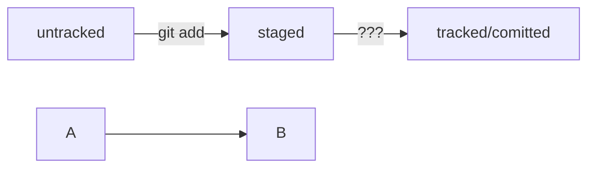

# Шпаргалка
## Команды консоли
1. pwd-команда показывает текущую директорию
2. cd [имя директории]-смена директории
3. touch [имя файла]- создает файл
4. mkdir [имя директории]-создает папку
5. rm [имя файла]-удаляет файл
6. rmdir[имя директории]-удаляет папку
---
## Команды Git
* git init-делает папку репозиторием
* git status-проверяет статус репозитория
* git add --all-подготавливает файлы к сохранению
* git commit -m 'комментарий'-делает коммит
* git remote add [имя удаленного репозитория] [URL]-связывает локальный и удаленный репозиторий
* git push origin master-отправляет изменнения на удаленный репозиторий
## Информация о хеше
*Хеш коммита* -основной индификатор коммита
Зная хеш коммита можно узнать и все остальное
---
## Информация о логе
git log --oneline - выдает сокращенный вариант инфомации о коммите
## Информация про HEAD
Файл **HEAD** указывает на коммит, который был сделан последним
---
## Статус файлов

## Оформление сообщений к коммитам

Важно чтобы все сообщения к коммитам были в одном стиле. Обычно о стилях сообщений в компании или команде договариваются заранее. 